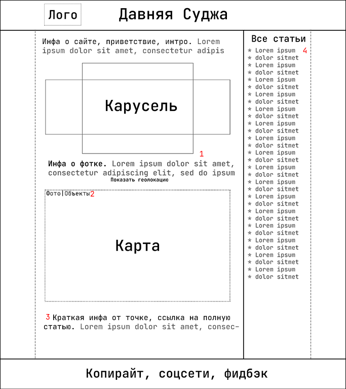
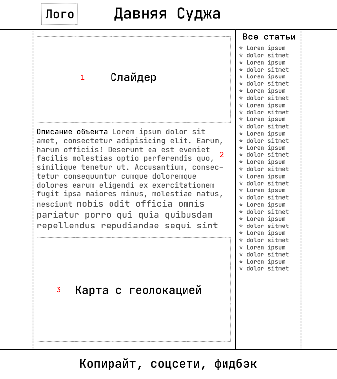
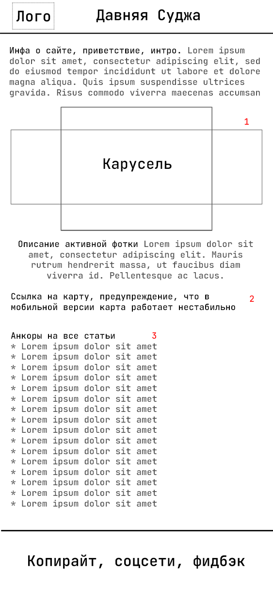
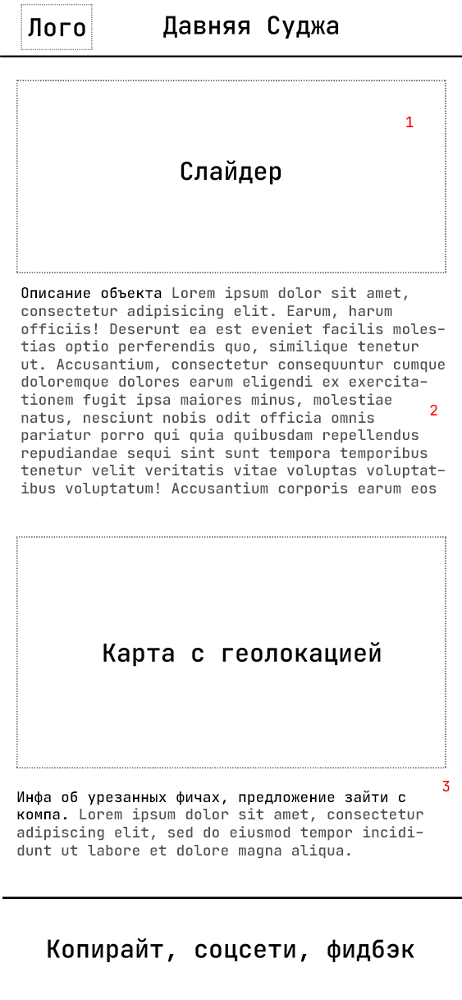

# Давняя Суджа

> The project is being developed in Russian. Translation into other languages is not planned for the foreseeable future.
## О проекте
Сайт для систематизации информации об исторически значимых местах Суджанского района.
Карта дает наглядное представление об уникальных архитектурных объектах, местах, связанных с известными людьми.
Для рассылки актуальной информации и общения с аудиторией создан бот в телеграм -
@old_sudga_bot ([dan-sazonov/old-sudga-bot](https://github.com/dan-sazonov/old-sudga-bot)).
_Разработка идет на ветке `develop`, для удобства она сделана дефолтной. В `main` сливается после прохождения
контрольной точки или после выпуска стабильной версии, законченной на данном этапе._
### Стек:
- **Front-end**: HTML5, [Scss](https://github.com/sass/sass) /CSS3, JS (ES8), [jQuery](https://github.com/jquery/jquery),
[Gulp 4](https://github.com/gulpjs/gulp), [Bootstrap 4](https://github.com/twbs/bootstrap)
- **Back-end**: [Django](https://github.com/django/django)
### npm scripts:
- `create` - устанавливает необходимые пакеты, включая глобальные
- `dev` - собирает проект, запускает отслеживание изменений, поднимает сервер на localhost, открывает его из Firefox DE
- `build` - собирает проект в директорию `dist`
- `test` - запускает ESlint, собирает проект
- `updateJS` - принудительное обновление js в `dist`

## ТЗ
### Цель:
- представить информацию об истории Суджанского края
### Задачи:
- собрать и систематизировать материал об исторически значимых местах Суджи и Суджанского района
- создать сайт для публикации материалов и обеспечить к нему доступ через QR-коды, размещенные на исторических объектах
### Целевая аудитория:
- люди, интересующиеся историей и краеведением
- школьники и студенты, изучающие историю и краеведение
- туристы, представители туристического бизнеса
## Контрольные точки, todo
- [Канбан](https://github.com/dan-sazonov/old-sudga/projects/1)
- [Логобук](/design/logobook.md)
- [Макет сайта](https://www.figma.com/file/5XTgdbaoxZckt15BIIGF2j/%D0%94%D0%B0%D0%B2%D0%BD%D1%8F%D1%8F-%D0%A1%D1%83%D0%B4%D0%B6%D0%B0-%D0%BC%D0%B0%D0%BA%D0%B5%D1%82?node-id=0%3A1)
- [X] Создание скетчей сайта, обсуждение ТЗ
- [X] Обсуждение тем с руководством Суджанского краеведческого музея
- [X] Обсуждение рабочих вопросов с администрацией Замостья
- [X] Обсуждение задач и их распределение
- [ ] Разработка дизайна _**(конец февраля)**_
- [ ] Верстка, фронт _**(февраль-март)**_
- [ ] Деплой фронта, настройка хостинга для работы с бэком. [Таск](https://github.com/dan-sazonov/old-sudga/projects/1#card-51482948) _**(начало марта)**_
- [ ] Бэк _**(конец марта)**_
- [ ] Деплоинг, фиксы _**(до середины апреля)**_
- [ ] Заполнение контентом _**(конец апреля)**_
- [ ] SEO, раскрутка, выход из беты _**(начало мая)**_
- [ ] Оптимизация, рефакторинг согласно todo _**(после первого стабильного релиза)**_
## Идеи
* При сканировании qr кода  открывается страница со статьей (шаблоны x-article). На ней, кроме текста,
галерея с фотографиями объекта (возможно, в разные годы), и карта, на которой точкой отмечено местоположение объекта.
* На главной странице сайта (шаблон x-home) карусель со старыми фотографиями, их описание, карта с отмеченными местами
с фото и объектами (подробнее - см. desktop-home).
* На изображениях - примерная схема расположения элементов на сайте (скетчи) для разных устройств (масштаб не соблюден).
### desktop-home (главная страница, версия для компов)

**1.** Фотографии исторических объектов (старой Суджи). При выборе фото внизу открывается описание объекта.
После нажатия на кнопку "Показать локацию" на карте будет точкой отмечено место с фотографии. 
**2.** Переключатель. В режиме "Фото" на карте отображены миниатюры фотографий.
При наведении открывается всплывающее окно с фоткой в нормальном размере.
В режиме "Объекты" на карте отмечены точками объекты, про которые есть статьи.
После нажатия на точку внизу **(3)** откроется краткое описание объекта и ссылка на полную статью. 
**4.** В боковом меню - ссылки на все статьи об объектах с qr-кодами.
### desktop-article (страница для статьи, версия для компов)

**1.** Фотографии исторических объектов (старой Суджи). При выборе фото внизу открывается описание объекта **(2)**,
на карте **(3)** точкой отмечается место с фотографии.
### mobile-home (главная страница, версия для телефонов)

**1.** Фотографии исторических объектов (старой Суджи). При выборе фото внизу открывается описание объекта. 
**2.** При переходе по ссылке откроется карта, на которой точкой отмечено место с фотографии. 
**3.** Ссылки на статьи об объектах с qr-кодами. 
### mobile-article (страница для статьи, версия для телефонов)

**1.** Фотографии объекта, о котором статья. 
**2.** Статья про объект. 
**3.** Карта, на которой точкой отмечен объект. Предупреждение, что карта может работать нестабильно. 
