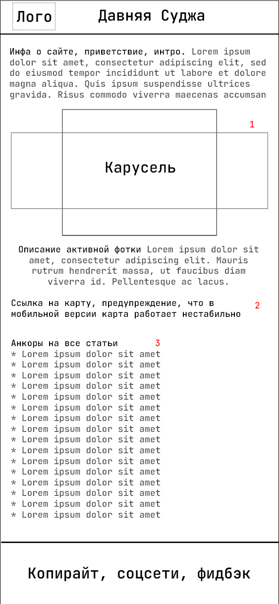
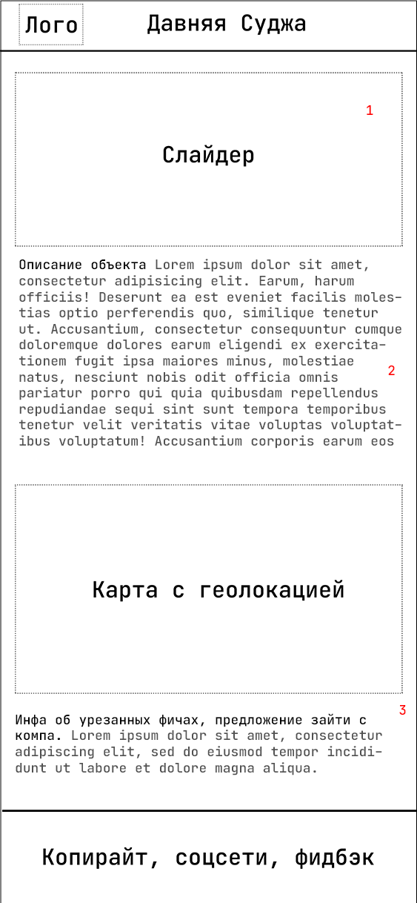

# Давняя Суджа    
 
> The project is being developed in Russian. Translation into other languages is not planned for the foreseeable future.    
## О проекте
Сайт для систематизации информации об исторически значимых местах Суджанского района. 
Карта дает наглядное представление об уникальных архитектурных объектах, местах, связанных с известными людьми.    
## ТЗ
**Задача:** собрать информацию об исторически значимых объектах Суджанского района и обеспечить удобный доступ к данному 
контенту через QR-коды, размещенные на объектах.    
## Статус проекта, todo
- [Канбан](https://github.com/dan-sazonov/old-sudga/projects/1)    

- [ ] Обсуждение
- [ ] Разработка дизайна
- [ ] Верстка, фронт
- [ ] Бэк
- [ ] Заполнение контентом
- [ ] Деплоинг
- [ ] ???
## Идеи
* При сканировании qr кода  открывается страница со статьей (шаблоны x-article). На ней, кроме текста,
галерея с фотографиями объекта (возможно, в разные годы), и карта, на которой точкой отмечено местоположение объекта.    
* На главной странице сайта (шаблон x-home) карусель со старыми фотографиями, их описание, карта с отмеченными местами 
с фото и объектами (подробнее - см. desktop-home).
* На изображениях - примерная схема расположения элементов на сайте (скетчи) для разных устройств (масштаб не соблюден).    
### desktop-home (главная страница, версия для компов)
    
    
**1.** Фотографии исторических объектов (старой Суджи). При выборе фото внизу открывается описание объекта.
После нажатия на кнопку "Показать локацию" на карте будет точкой отмечено место с фотографии.    
**2.** Переключатель. В режиме "Фото" на карте отображены миниатюры фотографий.
При наведении открывается всплывающее окно с фоткой в нормальном размере.
В режиме "Объекты" на карте отмечены точками объекты, про которые есть статьи.
После нажатия на точку внизу **(3)** откроется краткое описание объекта и ссылка на полную статью.    
**4.** В боковом меню - ссылки на все статьи об объектах с qr-кодами.    
### desktop-article (страница для статьи, версия для компов)
    
    
**1.** Фотографии исторических объектов (старой Суджи). При выборе фото внизу открывается описание объекта **(2)**, 
на карте **(3)** точкой отмечается место с фотографии.    
### mobile-home (главная страница, версия для телефонов)
    
    
**1.** Фотографии исторических объектов (старой Суджи). При выборе фото внизу открывается описание объекта.    
**2.** При переходе по ссылке откроется карта, на которой точкой отмечено место с фотографии.    
**3.** Ссылки на статьи об объектах с qr-кодами.    
### mobile-article (страница для статьи, версия для телефонов)
    
    
**1.** Фотографии объекта, о котором статья.    
**2.** Статья про объект.    
**3.** Карта, на которой точкой отмечен объект. Предупреждение, что карта может работать нестабильно.    