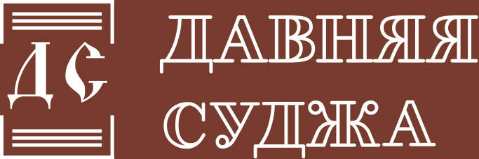

# Давняя Суджа - логобук
## Айдентика
### Палитра
Цветовая палитра выбрана в соответствии с историческими особенностями региона, где процветал гончарный промысел.
Цветовая палитра передает разнообразные оттенки изготавливаемых суджанскими мастерами керамических изделий и вызывает
ассоциации с народным промыслом, который стал визитной карточкой региона и сейчас возрождается.
Основной цвет - `#6A3D31`. Применимые тени и оттенки:

### Логотип
 
Логотип напоминает страницу исторического документа. Незамкнутые рамки символизируют открытость информации,
простор для исследований, неокончательную изученность темы и возможность нового контента. Основной шрифт напоминает
заголовки афиш прошлого века, это отсылает нас к истории Суджи, когда одной из главных местных достопримечательностей
был театр.
## Применение лого, альтернативные версии
Все версии в векторе - в текущей директории. Демонстрационные версии - `./demo/`. Исходники в psd - `./psd/`
### Основная горизонтальная компоновка
 
 
> logo-horizontal

Версия для прямоугольных, горизонтальных форматов использования, без ограничения по размеру. Например, логотип в шапке
сайта.
### Упрощенная горизонтальная компоновка

 
> logo-small

Применим на мелких носителях, например, стикеры, карандаши, магниты и т. д.
### Основная вертикальная компоновка

 
> logo-vertical

Версия для прямоугольных, горизонтальных форматов использования: таблички в городе, плакаты.
### Упрощенная вертикальная компоновка

 
> logo-simple

Версия для прямоугольных, горизонтальных форматов c ограниченным размером. Например, фавиконки, юзерпики в социальных
сетях.

 
> logo-simple-dark-sq

Версия для квадратных форматов.

 
> logo-simple-w-borders

Версия для размещения на фоне белого или основного цвета.

## Допустимое использование
__Размер:__
- Для horizontal и simple: ширина вертикальных "рамок документа" должна быть не меньше 2 px.
- Для vertical: ширина вертикальных "рамок документа" должна быть не меньше 6 px.
- Для small: не регламентирован, но должна обеспечиваться читаемость текста "ДАВНЯЯ СУДЖА".

__Альтернативные цветовые гаммы:__
- Допускается использование в черно-белом, монохромном, негативном исполнениях.

__Охранное поле:__
- 1/6 от ширины "документа".

__Недопустимое использование:__
- Изменение композиции;
- Изменение пропорций;
- Размещение логотипа на неконтрастном фоне;
- Изменение основных цветов, применение теней или спецэффектов;
- Изменение шрифта, кегля или начертания текстовой части.
